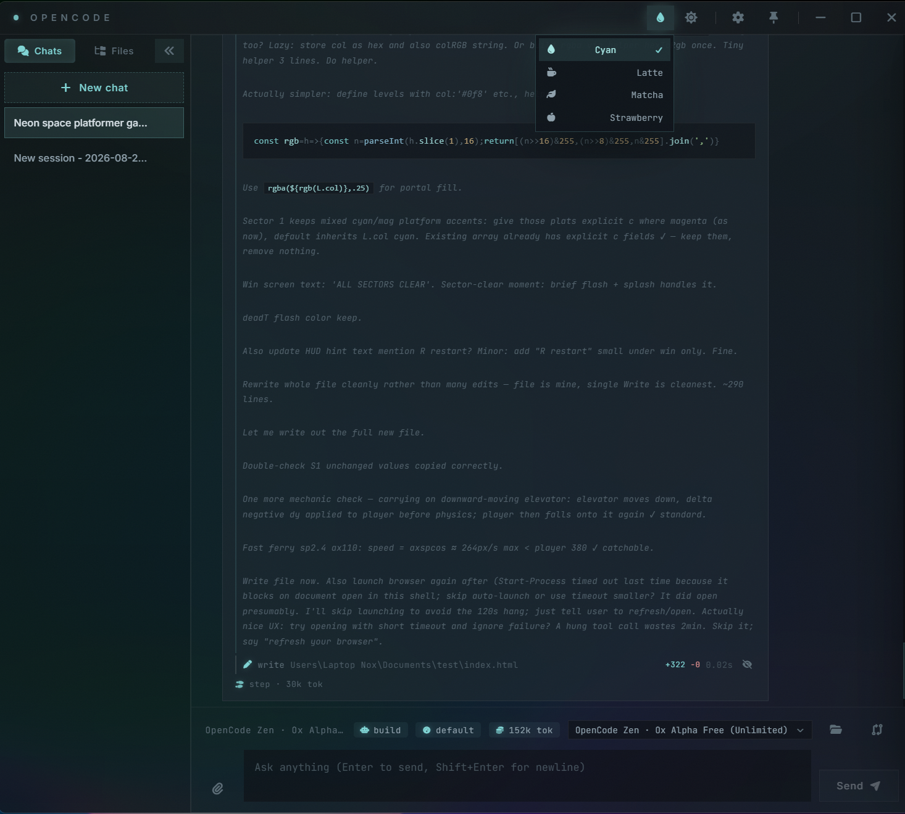

# opencode-gui

Lightweight Windows GUI client for [opencode](https://opencode.ai). Tauri v2 + React + TypeScript, spawns an `opencode serve` sidecar and talks to it over HTTP/SSE.



See [PLAN.md](./PLAN.md) for architecture and [IMPLEMENTED.md](./IMPLEMENTED.md) for progress.

## Requirements

Windows 10/11 (WebView2 ships with Windows), Node 20+, Rust stable + MSVC Build Tools.

## Dev

```
powershell -ExecutionPolicy Bypass -File scripts\run.ps1 setup    # first time: deps + sidecar binary
powershell -ExecutionPolicy Bypass -File scripts\run.ps1 dev      # run the app
powershell -ExecutionPolicy Bypass -File scripts\run.ps1 build    # MSI installer → src-tauri/target/release/bundle
powershell -ExecutionPolicy Bypass -File scripts\run.ps1 portable # portable zip (exe + sidecar) → bundle/portable
powershell -ExecutionPolicy Bypass -File scripts\run.ps1 check    # tsc + vite + cargo check
powershell -ExecutionPolicy Bypass -File scripts\run.ps1 clean    # cargo clean + remove dist
```

`scripts/run.sh` is the same runner for bash/WSL (`./scripts/run.sh dev`). `build`/`portable` take an optional target `win11` (default, glass/acrylic) / `win10` (no-glass) / `both` and an optional bundle list (`msi`, `nsis`); e.g. `run.ps1 build win11 "msi nsis"`. The sidecar binary (`src-tauri/binaries/opencode-x86_64-pc-windows-msvc.exe`) is not committed; `setup` downloads it from [opencode releases](https://github.com/anomalyco/opencode/releases) automatically.

## Structure

State/server logic lives in `src/hooks/`, presentational pieces in `src/components/` (one CSS file each in `src/styles/`), screens in `src/pages/`. Full tree and conventions in [PLAN.md](./PLAN.md); design tokens and persistence keys in [AGENTS.md](./AGENTS.md).

## Plugins

Optional features ship as runtime plugins. A plugin is a folder with `plugin.json` + `main.js` (+ optional `styles.css`) under `%USERPROFILE%\.config\.opencode-gui\plugins\` (next to `themes.json`). Plugins are browser ESM: `main.js` default-exports `activate(api)` and can contribute voice intents, settings sections, `info.voice`/`info.keys` docs, and spoken feedback. Files hot-reload on save; broken plugins surface as a banner and are skipped.

Install the bundled example (voice control for Tuya Smart Life bulbs — on/off, brightness, white tone, color):

```powershell
New-Item -ItemType Directory -Force "$env:USERPROFILE\.config\.opencode-gui\plugins" | Out-Null
Copy-Item -Recurse default_plugins\tuya-lights-control "$env:USERPROFILE\.config\.opencode-gui\plugins\"
```

Then set credentials in Settings › Lights (free project at iot.tuya.com). See [default_plugins/tuya-lights-control](./default_plugins/tuya-lights-control) for the full API example; its `test.mjs` is a runnable self-check.
